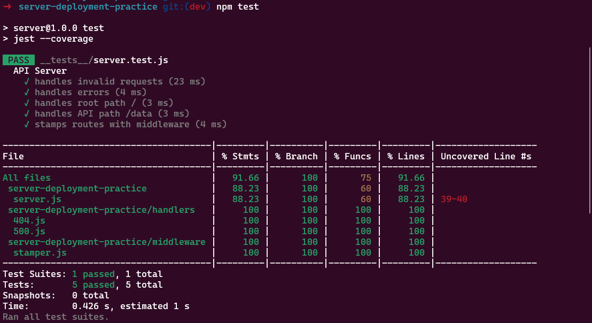
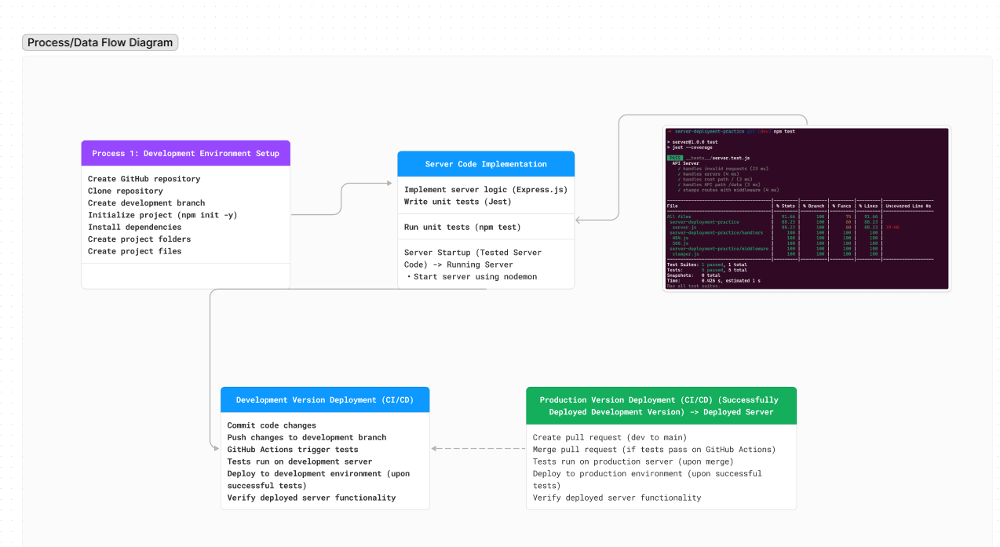

# server-deployment-practice
- [class1: Instructor note README](https://github.com/codefellows/seattle-javascript-401d58/tree/main/class-01)
- [My render deployment](https://server-deployment-practice-1njr.onrender.com/)
- [Github action link](https://github.com/QILINXIE02/server-deployment-practice/actions/runs/8885317452)
- [PR to main](https://github.com/QILINXIE02/server-deployment-practice/actions/runs/8885317452)

# Project Title

## Installation and Testing

### How to Install the App or Library?

To install the application, clone the repository to your local machine:

1. Git clone [<https://github.com/QILINXIE02/server-deployment-practice.git>](https://github.com/QILINXIE02/server-deployment-practice.git)

2. Install your dependencies – npm install dotenv express jest supertest

3. Test your server – npm test 

##Documentation
UML/Process/Data Flow Diagram:
